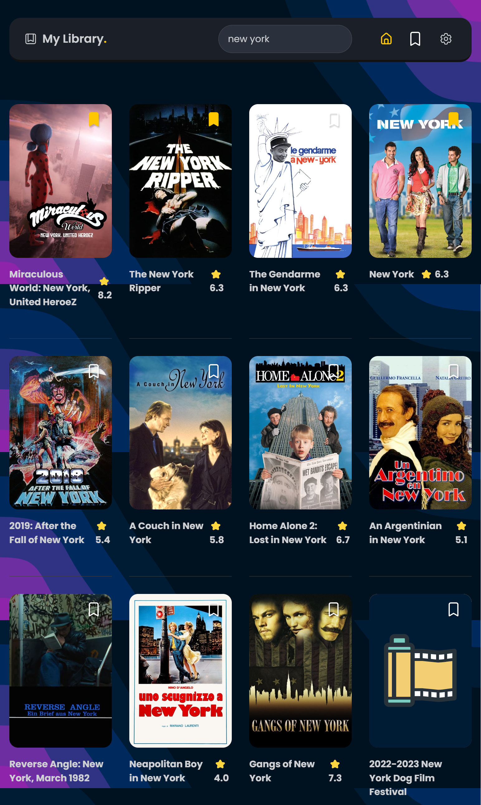

# Movie watch list in Vue JS (3)

The project is to build a small app to keep a list of movies i want to watch.
It is bootstraped with Vite.js.

🔗 **Live preview:** [here](https://jolly-madeleine-93d3fe.netlify.app/)

### Screenshot

## Built with

### Technologies

- HTML
- CSS
- Vue JS
- Pinia for state management
- Vue Router
- TheMovieDataBase.com API

### Tools

- Vite
- TailwindCSS + DaisyUI

## Features

- Simple app with movie search (multiple calls to TMDB api)
- Can save movie to a watchlist
- Can mark movie as watched
- Can remove movie from watchlist
- Data saved in local storage
- Can access to detail page

## What I learned

- Better knowledge of **Vue JS**.(Pinia and vue router)
- Try DaisyUi

## Author

👤 **Edouard Desgrée**

- GitHub: [edesgree](https://github.com/edesgree)
